# 创新点试用展示：四个新功能在哪里、怎么玩、看到什么

> 写者：ZCode（证据线）。日期：2026-09-08。
> 所有截图来自 **2026-09-08 重新部署后的运行栈**（revision `cc4eb8a`，即包含全部四个创新点与可视化精修的最新版本）。
> 测试账号：演示管理员（`?demo=true` 免密直达）；项目：**#10 乳腺癌外泌体 miRNA 标志物筛选课题**。
> 给不参与 coding 的读者：每节先说"这是什么"，再说"去哪里点"，最后说"你能看到什么"。

---

## 怎么进入系统

浏览器打开 `http://localhost:3000/login?demo=true`（自动以管理员身份登录），进入项目 **"乳腺癌外泌体 miRNA 标志物筛选课题（2026 秋季批次）"** 工作台。

---

## 创新点一：动态知识蓝图（计划 vs 实际）

**这是什么**：把研究计划书交给 AI 读一遍，自动整理成"计划要覆盖哪些知识点"的网图（15 个计划知识点、14 条关联）。之后每条实验记录审核通过，系统自动把实际做过的知识点在蓝图上"点亮"。计划和实际一对照，缺口就是下一步该做的事。

**去哪里点**：项目工作台 → 顶部标签 **"图谱"** → 页内第二个标签 **"知识蓝图（计划态 vs 实证态）"**。

**你能看到什么**：

1. 顶部横幅直接给出覆盖度：当前 **"实证覆盖 1 / 15 个计划知识点"**（7%）——只有"外泌体提取"这个计划知识点被真实实验记录覆盖了。
2. 蓝图大图：实心节点 = 已被实验记录实证；虚线流光节点 = 待实证缺口。
3. 右侧 **"下一步指引（待实证知识缺口）"** 面板列出 14 个缺口（乳腺癌患者血浆样本、TRIzol 试剂、miRNA 测序……），点任何一个缺口，下方面板显示该知识点的 **来源类型（项目计划书）、优先级、规划描述**，并有 **"定位在蓝图中"** 和 **"作废此计划节点"** 两个按钮——导师可以人工修订计划。
4. 底部"来源文档解析历史"记录这份蓝图是解析哪份文档得来的（乳腺癌外泌体项目计划书 v1，AI 解析）。

| 截图 | 内容 |
| --- | --- |
|  | 蓝图页全景：覆盖度横幅 + 蓝图大图 + 右侧缺口清单 |
| 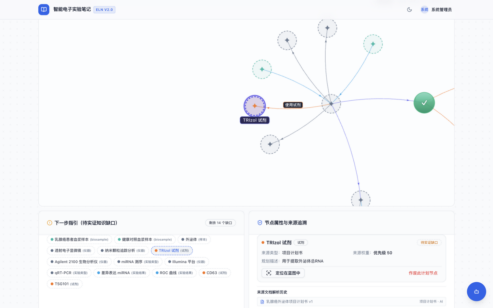 | 点开"TRIzol 试剂"缺口后的来源追溯面板（来源类型/优先级/规划描述/定位与作废按钮） |

**试用要点**：页面还有 **"解析计划书 / 组会纪要"** 按钮——你可以贴一段新计划文本让它重新解析，体验"增量更新"（已有知识点的计划会被合并而不是推倒重来）。

---

## 创新点二：AI 导师助手（主动建议 + 思维链）

**这是什么**：全项目通用的工作区 Agent。它会在 AI 问答页顶部**主动**给出"下一步建议"（原料正是蓝图缺口），你也可以随时指挥它。回答里的每个关键事实都带 `[S]`（资料）/`[G]`（图谱）编号引用，系统还自动做"引用校验"。

**去哪里点**：任意页面右下角 **"打开 Agent 助手"** 浮动按钮；或项目工作台 → **"AI 问答"** 标签（顶部即是主动建议卡片）。

**你能看到什么**：

1. **AI 问答页顶部**："AI 导师助手 · 下一步建议"卡片，开头就是蓝图联动信息 **"蓝图覆盖 7%（14/15 待实证）"**，然后给出三条分步建议（梳理样本与外泌体分离流程 → 掌握表征与 RNA 提取方法 → 明确测序验证与数据分析要点），每条建议里的知识点都是**可点击链接，直接跳到图谱对应节点**。
2. **Agent 侧栏**：把问题"下一步该做什么实验？给出建议"发给助手，回答逐条引用 [S1]–[S4]、[G1]–[G9] 编号；证据不足以断言时明说 **"需要人工复核……无法确认部分……"**（这是系统刻意的诚实行为，不是缺陷）。
3. **引用校验横幅**：每次回答下方显示"引用校验通过，共核对 22 个证据编号"之类的结果与降级状态（本次示例为 needs_review——校验机制在工作，提示部分关键事实缺强制引用）。

| 截图 | 内容 |
| --- | --- |
| 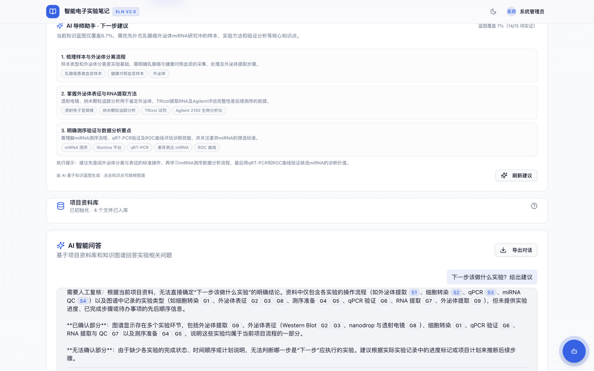 | AI 问答页：顶部蓝图驱动建议卡 + 带引用问答 + 引用校验横幅 |
| 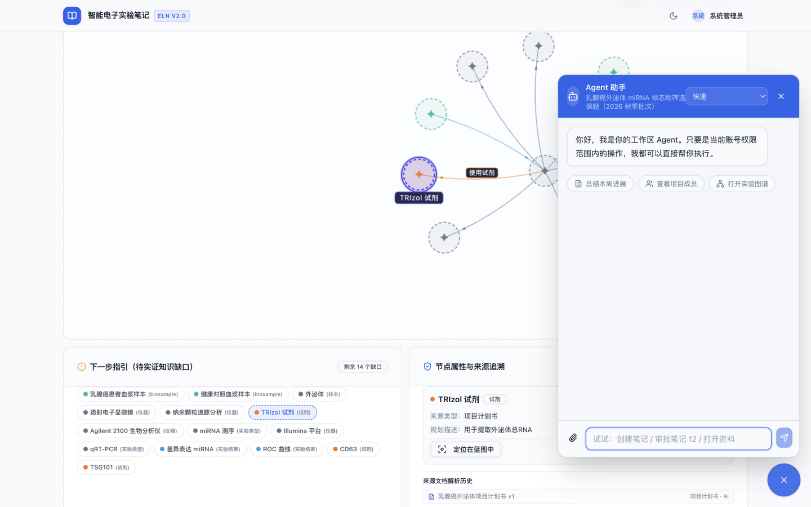 | 右下角 Agent 助手面板（快速/深度两档模式） |
| 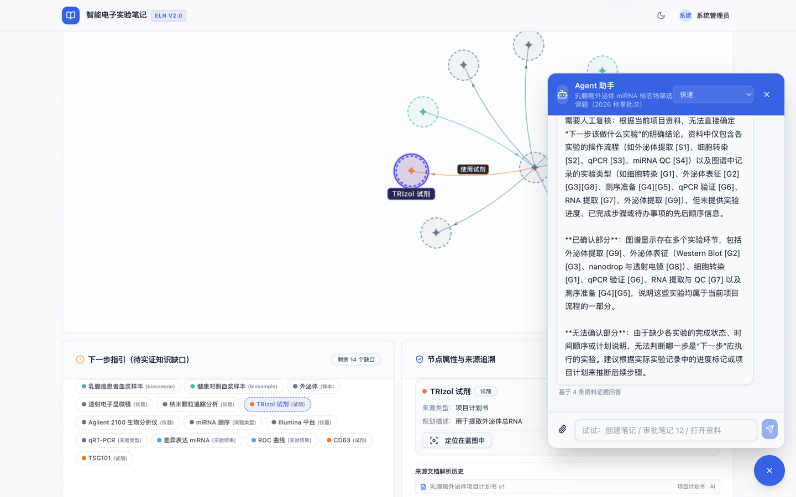 | 助手回答带 [S]/[G] 引用并明示"需要人工复核" |

---

## 创新点三：图谱可视化语义映射

**这是什么**：把"看懂一张知识网"需要的信息拆成多条**视觉通道**：颜色=实体类型、大小=关联度（枢纽）、连线颜色=关系语义、悬停聚焦=局部证据链、抽屉数值=证据时效。目标是导师不点开任何节点也能"一眼分层"。

**去哪里点**：项目工作台 → **"图谱"** 标签 → 默认的 **"实证图谱（五通道可视化）"**。

**你能看到什么**：

1. 全景图 86 节点/95 关系；顶部统计卡（节点总数、关系总数、类别覆盖、平均度数）。
2. 左侧筛选区：实体类型/关系类型下拉、类别过滤按钮（试剂 21、样本 15、实验结果 18……）、"包含一度关联"开关。
3. **"实验直达"导航带**：按实验笔记一键聚焦子图（如"实验 #5: qPCR 验证"），配合"包含一度关联"开关，只显示该实验直接相关的节点与连线——这是导师精读单条实验的入口。
4. **悬停聚焦**：鼠标停在节点上只保留它和一跳邻居，背景整体淡出，相连边浮现语义标签药丸。
5. **"实体色板图例"**：展开后是 17 类实体颜色对照表。
6. 右上 **"标签"** 开关：给节点加名字（默认关闭防拥挤）。

| 截图 | 内容 |
| --- | --- |
| 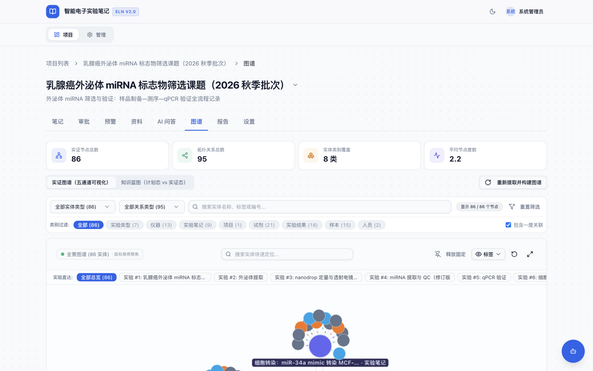 | 实证图谱全景（颜色/大小通道 + 顶部统计卡） |
| 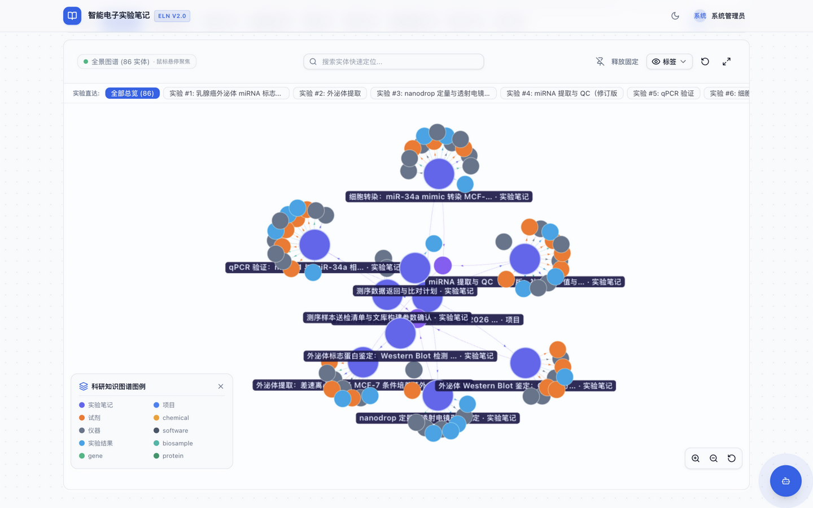 | 展开实体色板图例 |
| 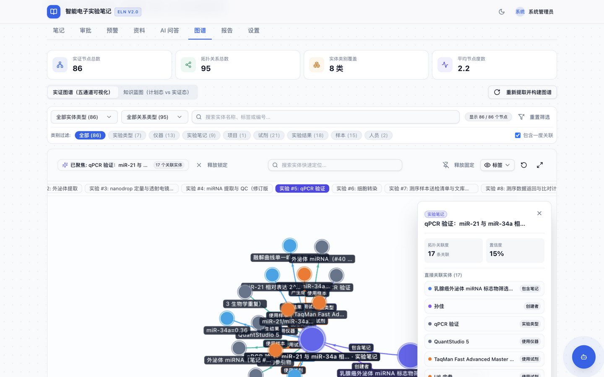 | "实验 #5: qPCR 验证"直达聚焦后的局部子图 |
| 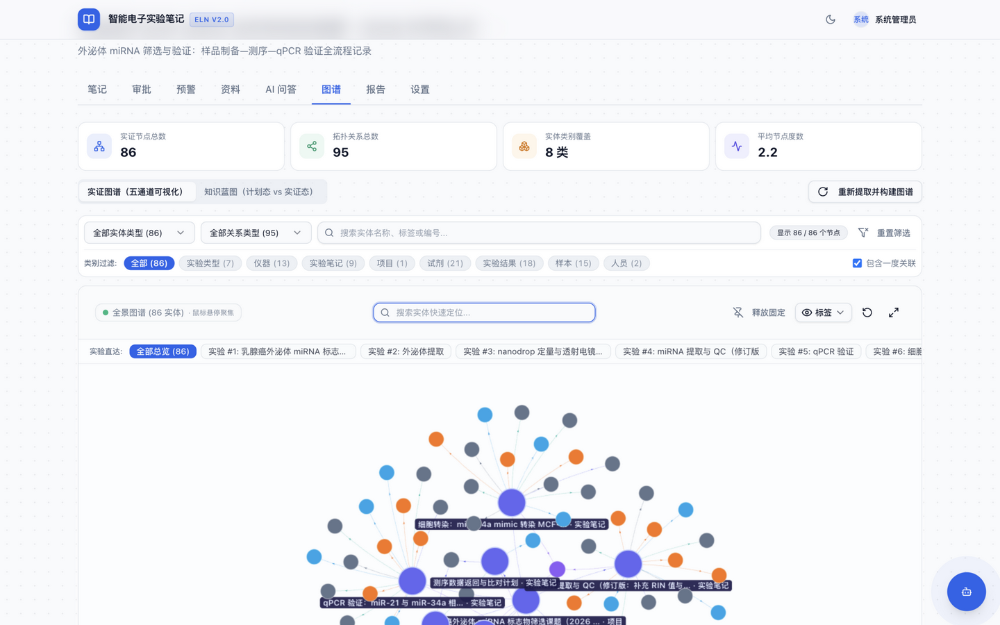 | 鼠标悬停触发的一跳局部聚焦（背景淡出） |
| 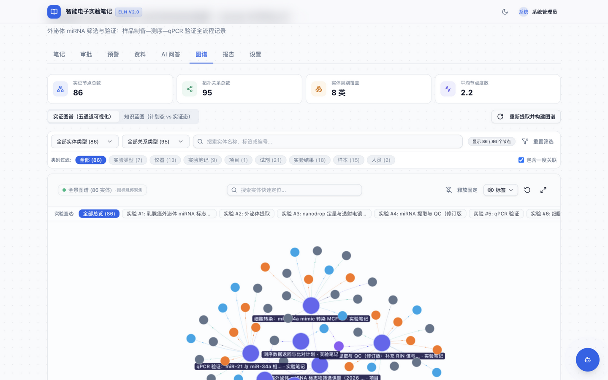 | 开启"标签"后的节点命名状态 |

---

## 创新点四：预警与人工审核闭环

**这是什么**：系统按四个指标自动巡检项目（审批停滞时长、进展偏差、数据完整性、反馈及时性），指标越界自动报警进"预警收件箱"。导师确认报警、可调阈值——每个人工动作都进审计日志，构成"AI 提醒 + 人工干预"的闭环。

**去哪里点**：项目工作台 → **"预警"** 标签。

**你能看到什么**：

1. **预警收件箱**：一条真实报警——**"紧急 · 进展偏差 · 当前值 93%"**（蓝图待实证知识点占比 93%，超过 warn 70% / critical 90% 阈值），下方有"确认备注"输入框和 **"确认"** 按钮。
2. **历史预警**区：已确认的报警留痕（时间、指标、数值）。
3. 顶部 **"调整阈值"**：弹窗里可按项目自定义各指标的 warn/critical 两档阈值（当前阈值是内置经验值）；**"立即评估"** 手动触发一次巡检。

| 截图 | 内容 |
| --- | --- |
| 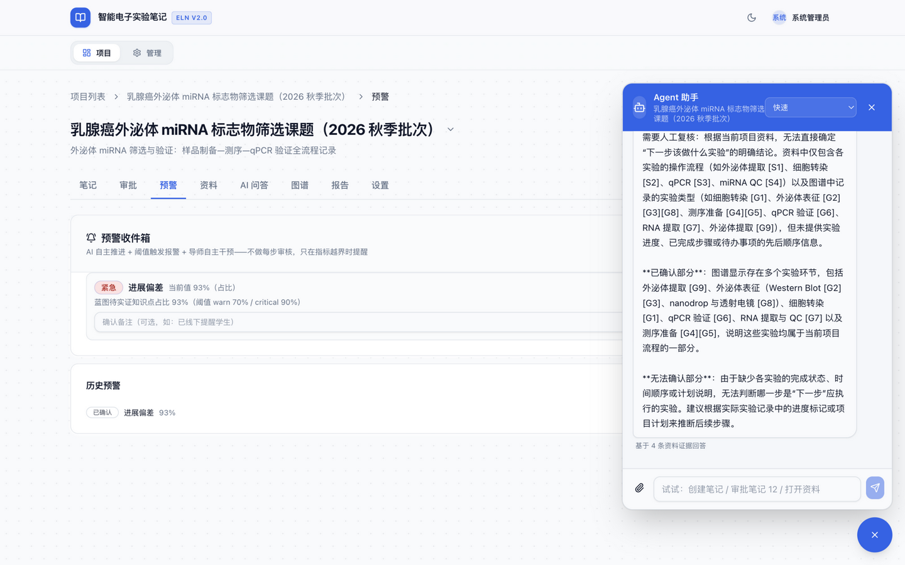 | 预警收件箱：紧急进展偏差报警 + 确认操作 |
| 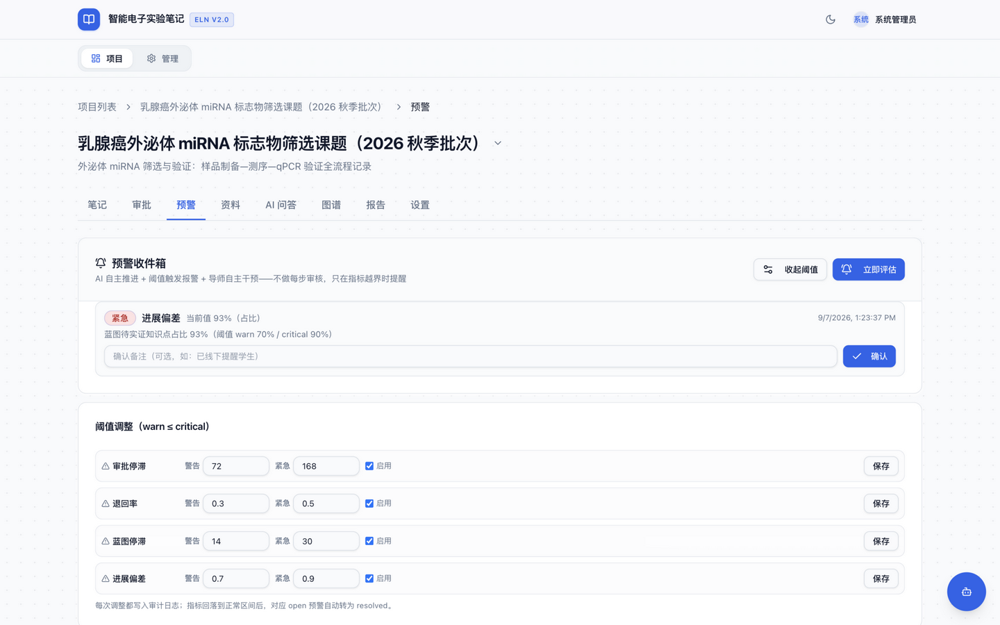 | 调整阈值弹窗（各指标 warn/critical 两档） |

---

## 四个创新点怎么串成一条线（试用顺序建议）

1. 先看**蓝图**（图谱 → 知识蓝图）：计划态覆盖 1/15；
2. 再看 **AI 建议**（AI 问答页顶部）：建议内容正是"先把缺口补上"，且每个知识点可跳图谱；
3. 回到**图谱**：用"实验直达"或悬停聚焦看已实证的部分（大小=枢纽、颜色=类型）；
4. 最后看**预警**：因为计划缺口太大，系统已自动报了一条"进展偏差 93%"紧急报警——这正是"蓝图 → 预警"联动的活例子；
5. 补一条实验笔记并审批通过，蓝图覆盖度就会涨、建议会刷新、图谱会长出新节点。

---

## 版本与边界声明（诚实口径）

- 本文档截图均来自 2026-09-08 部署的 `cc4eb8a` 版本运行栈（`/ready` 已核实 revision）。
- 蓝图覆盖度、报警数值为演示数据的真实系统输出，非摆拍。
- 试用中 Agent 助手对"下一步做什么"的回答出现"需要人工复核"降级，属预期诚实行为。
- 已知前端待改进项（悬停命中率、弹窗遮挡等）见《创新点前端可用性评估-v1.md》。
