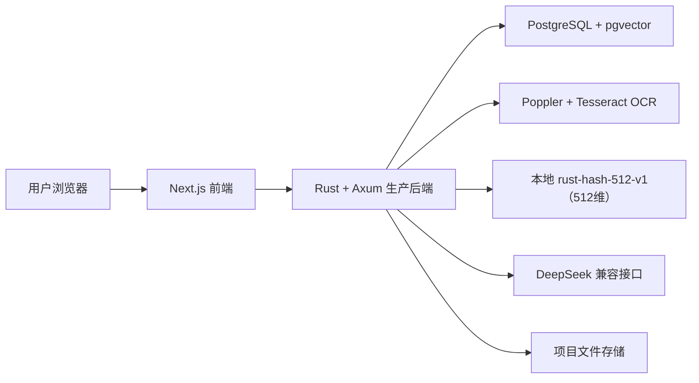
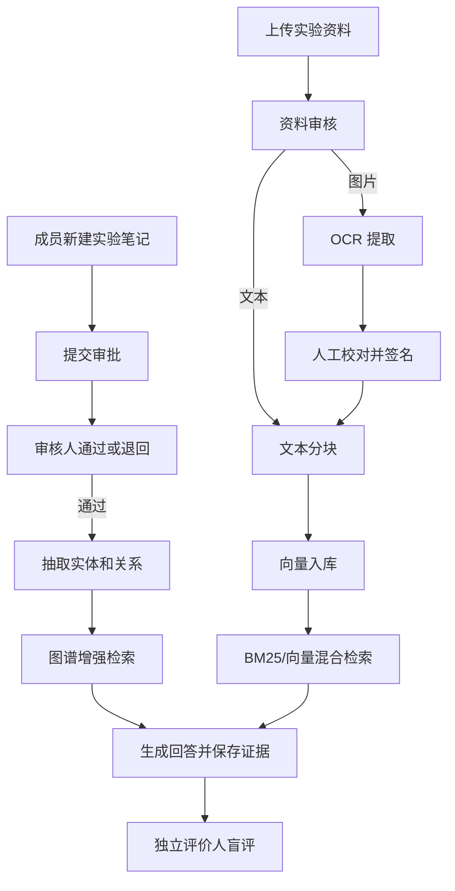

# 系统架构与业务流程

```mermaid
flowchart LR
  U["用户浏览器"] --> F["Next.js 前端"]
  F --> A["Rust + Axum 生产后端"]
  A --> P["PostgreSQL + pgvector"]
  A --> O["Poppler + Tesseract OCR"]
  A --> E["本地 rust-hash-512-v1（512维）"]
  A --> D["DeepSeek 兼容接口"]
  A --> S["项目文件存储"]
```

> `backend/app` 中的 FastAPI 代码属于历史兼容实现，不是生产运行时。

```mermaid
flowchart TD
  N1["成员新建实验笔记"] --> N2["提交审批"]
  N2 --> N3["审核人通过或退回"]
  N3 -->|通过| N4["抽取实体和关系"]
  F1["上传实验资料"] --> F2["资料审核"]
  F2 -->|图片| F3["OCR 提取"]
  F3 --> F4["人工校对并签名"]
  F2 -->|文本| F5["文本分块"]
  F4 --> F5
  F5 --> F6["向量入库"]
  N4 --> Q["图谱增强检索"]
  F6 --> R["BM25/向量混合检索"]
  Q --> G["生成回答并保存证据"]
  R --> G
  G --> H["独立评价人盲评"]
```
