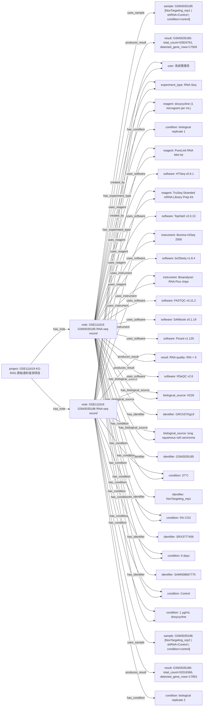

# 知识图谱实表样例

项目：GSE111619 KG-RAG 原始语料盲测项目

```mermaid
flowchart LR
  N1["project: GSE111619 KG-RAG 原始语料盲测项目"]
  N2["note: GSE111619 GSM3035185 RNA-seq record"]
  N3["user: 系统管理员"]
  N4["experiment_type: RNA-Seq"]
  N5["reagent: doxycycline (1 microgram per mL)"]
  N6["reagent: PureLink RNA Mini kit"]
  N7["reagent: TruSeq Stranded mRNA Library Prep Kit"]
  N8["instrument: Illumina HiSeq 2500"]
  N9["instrument: Bioanalyzer RNA Pico chips"]
  N10["sample: GSM3035185 [NonTargeting_rep1 | shRNA=Control | condition=control]"]
  N11["result: GSM3035185: total_count=53924761, detected_gene_rows=17926"]
  N12["result: RNA quality: RIN > 9"]
  N13["biological_source: H226"]
  N14["biological_source: lung squamous cell carcinoma"]
  N15["condition: 37°C"]
  N16["condition: 5% CO2"]
  N17["condition: 6 days"]
  N18["condition: Control"]
  N19["condition: 1 µg/mL doxycycline"]
  N20["condition: biological replicate 1"]
  N21["software: HTSeq v0.6.1"]
  N22["software: TopHat2 v2.0.13"]
  N23["software: bcl2fastq v1.8.4"]
  N24["software: FASTQC v0.11.2"]
  N25["software: SAMtools v0.1.19"]
  N26["software: Picard v1.129"]
  N27["software: RSeQC v2.6"]
  N28["identifier: GRCh37/hg19"]
  N29["identifier: GSM3035185"]
  N30["identifier: NonTargeting_rep1"]
  N31["identifier: SRX3777456"]
  N32["identifier: SAMN08667775"]
  N33["note: GSE111619 GSM3035186 RNA-seq record"]
  N34["sample: GSM3035186 [NonTargeting_rep2 | shRNA=Control | condition=control]"]
  N35["result: GSM3035186: total_count=52016366, detected_gene_rows=17953"]
  N36["condition: biological replicate 2"]
  N1 -->|"has_note"| N2
  N2 -->|"created_by"| N3
  N2 -->|"has_experiment_type"| N4
  N2 -->|"uses_reagent"| N5
  N2 -->|"uses_reagent"| N6
  N2 -->|"uses_reagent"| N7
  N2 -->|"uses_instrument"| N8
  N2 -->|"uses_instrument"| N9
  N2 -->|"uses_sample"| N10
  N2 -->|"produces_result"| N11
  N2 -->|"produces_result"| N12
  N2 -->|"has_biological_source"| N13
  N2 -->|"has_biological_source"| N14
  N2 -->|"has_condition"| N15
  N2 -->|"has_condition"| N16
  N2 -->|"has_condition"| N17
  N2 -->|"has_condition"| N18
  N2 -->|"has_condition"| N19
  N2 -->|"has_condition"| N20
  N2 -->|"uses_software"| N21
  N2 -->|"uses_software"| N22
  N2 -->|"uses_software"| N23
  N2 -->|"uses_software"| N24
  N2 -->|"uses_software"| N25
  N2 -->|"uses_software"| N26
  N2 -->|"uses_software"| N27
  N2 -->|"has_identifier"| N28
  N2 -->|"has_identifier"| N29
  N2 -->|"has_identifier"| N30
  N2 -->|"has_identifier"| N31
  N2 -->|"has_identifier"| N32
  N1 -->|"has_note"| N33
  N33 -->|"created_by"| N3
  N33 -->|"has_experiment_type"| N4
  N33 -->|"uses_reagent"| N5
  N33 -->|"uses_reagent"| N6
  N33 -->|"uses_reagent"| N7
  N33 -->|"uses_instrument"| N8
  N33 -->|"uses_instrument"| N9
  N33 -->|"uses_sample"| N34
  N33 -->|"produces_result"| N35
  N33 -->|"produces_result"| N12
  N33 -->|"has_biological_source"| N13
  N33 -->|"has_biological_source"| N14
  N33 -->|"has_condition"| N15
  N33 -->|"has_condition"| N16
  N33 -->|"has_condition"| N17
  N33 -->|"has_condition"| N18
  N33 -->|"has_condition"| N19
  N33 -->|"has_condition"| N36
```
