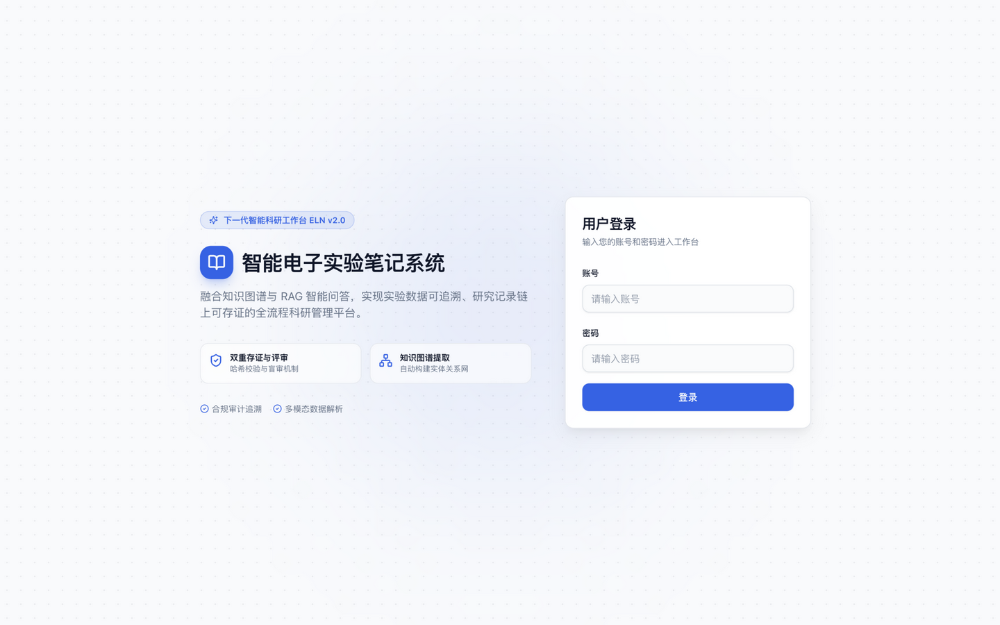
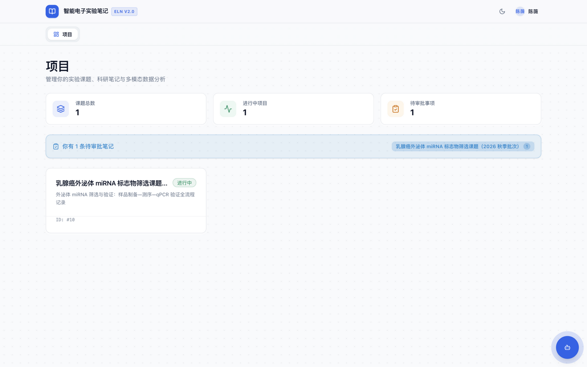
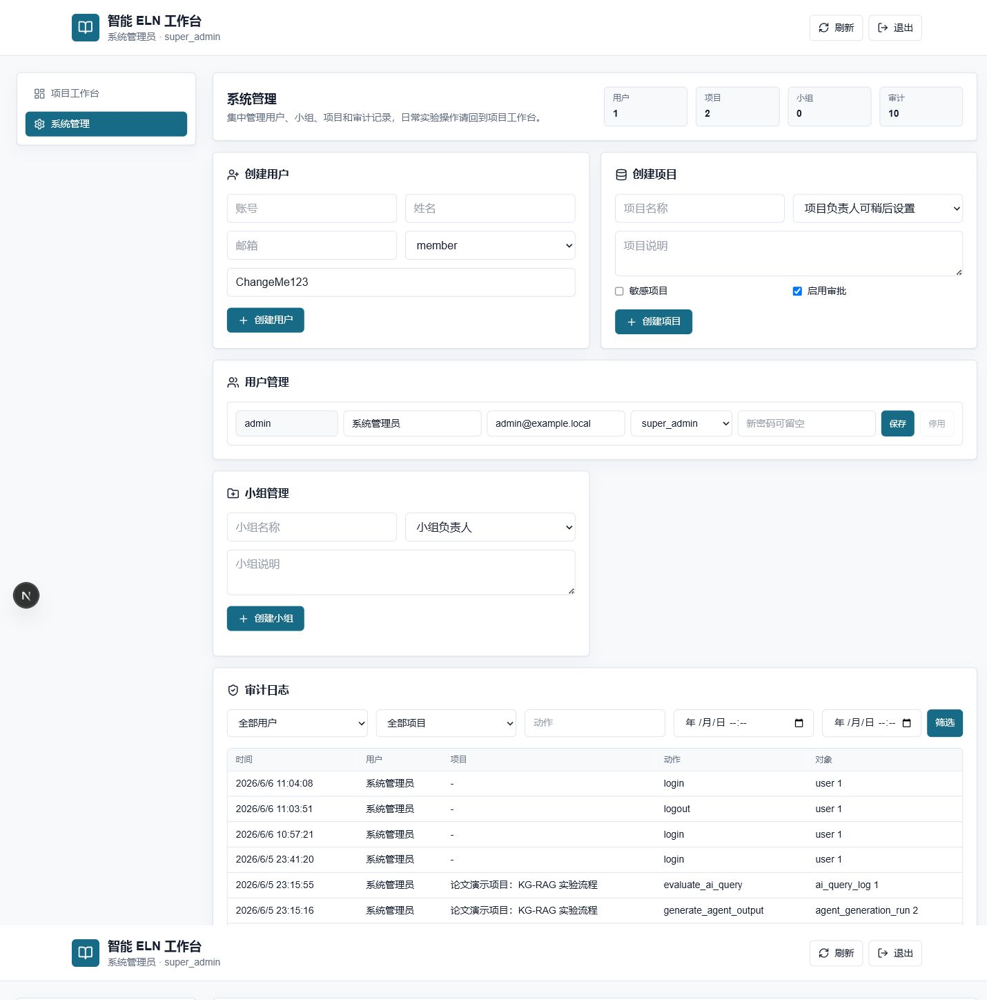
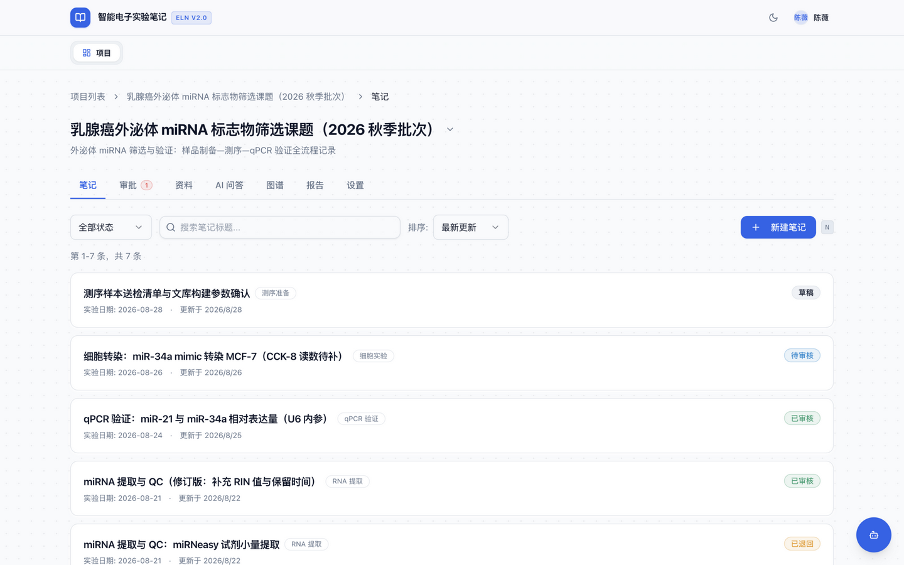
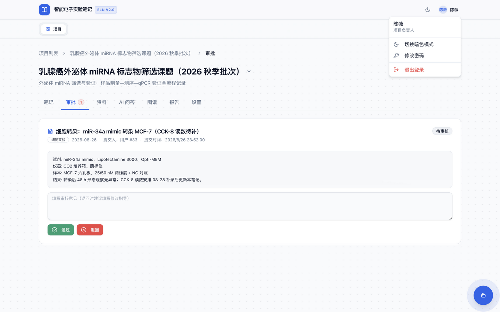
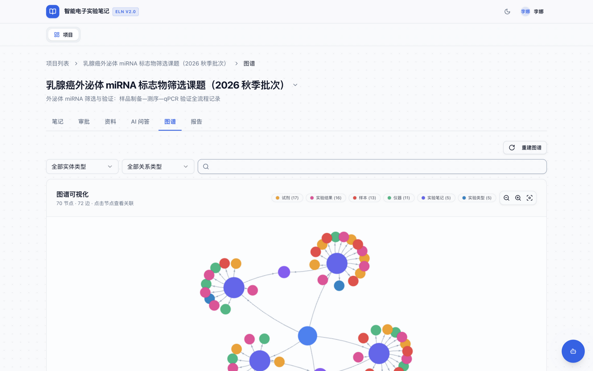
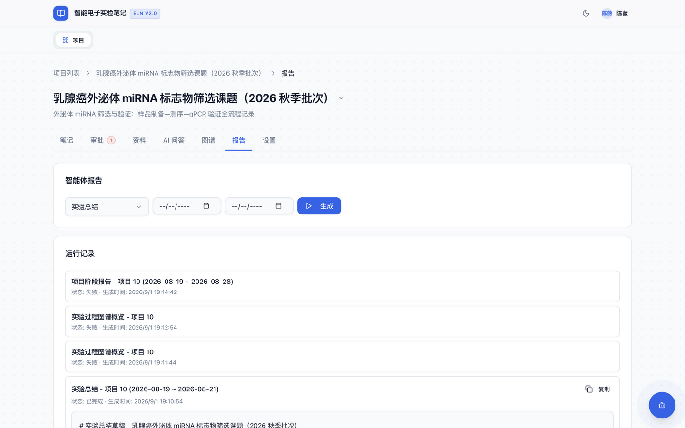
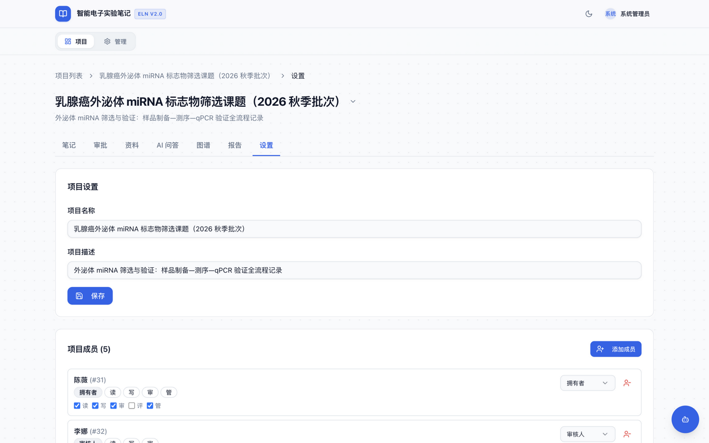

# 智能电子实验笔记系统用户使用手册

本文档面向课题组管理员、项目负责人、审核人员和普通实验成员,说明如何使用智能电子实验笔记系统完成项目管理、实验笔记记录、资料库管理、知识图谱查看、AI 问答评价、智能生成和审计追溯。

系统地址:

```text
http://localhost:3000
```

本地开发环境初始管理员账号:

```text
账号:admin
密码:admin123
```

> 生产环境不会在登录页显示或预填初始凭据。首次登录后可点击顶部“改密”，修改成功后其他已登录会话会立即失效。

## 1. 登录系统

打开系统地址后,在登录页输入账号和密码,点击"登录工作台"。



登录成功后进入工作台。左侧有两个工作区:

- 项目工作台:用于日常实验记录、资料库、知识图谱、AI 问答和智能生成。
- 系统管理:用于管理员创建用户、创建项目、管理小组和查看全局审计日志。

## 2. 进入项目工作台

登录后默认进入"项目工作台"。在左侧"我的项目"中选择项目,例如"论文演示项目:KG-RAG 实验流程"。

项目顶部会展示当前项目的核心状态:

- 实验笔记数量
- 项目文件数量
- AI 能力状态
- 图谱实体数量
- 图谱关系数量
- 问答记录数量
- 智能生成记录数量



项目内主要功能标签包括:

- 项目概览
- 实验笔记
- 资料库
- 搜索
- 知识图谱
- 报告
- 审批中心
- 成员权限
- 项目日志

## 3. 系统管理

管理员点击左侧"系统管理",可以进入系统级配置页面。

可完成的操作包括:

- 创建用户
- 创建项目
- 修改用户信息和角色
- 创建小组
- 查看和筛选审计日志



建议操作顺序:

1. 创建系统用户。
2. 创建项目。
3. 在项目的"成员权限"中授权成员。
4. 由成员进入项目填写实验笔记。

## 4. 创建和管理实验笔记

进入项目后点击"实验笔记"标签。

在该页面可以:

- 创建实验笔记
- 选择实验模板
- 填写结构化字段
- 填写实验过程正文
- 保存草稿
- 提交审核
- 查看版本记录和审核记录



实验笔记提交审核、审核通过后，系统会自动触发知识图谱抽取。草稿和未审核内容不会进入知识图谱。抽取结果会进入项目知识图谱，用于后续图谱增强 RAG 问答和智能生成。

## 5. 资料库与 AI 问答评价

点击"资料库"标签,可以管理项目资料和 AI 知识库。

资料库页面包含两部分:

- AI 知识库与问答记录
- 附件与资料管理



### 5.1 上传资料

普通成员或有写入权限的用户可以上传文件。

未选择实验笔记时上传的文件会作为项目资料;选择实验笔记后上传的文件会作为该笔记附件。

### 5.2 审核资料

审核人员或管理员可以审核资料。资料审核通过后,才能同步到 AI 知识库。

### 5.3 初始化和同步 AI 知识库

审核人员或管理员初始化项目知识库后,可以将审核通过的资料同步到 AI 知识库。

页面会展示:

- 知识库是否已初始化
- 待同步数量
- 已入库数量
- 同步失败数量

### 5.4 AI 问答与评价

在输入框中输入问题并点击"提问"。系统会优先结合项目资料库和知识图谱上下文回答。

每次问答都会保存为问答记录,记录内容包括:

- 问题
- 回答
- 回答模式
- 图谱命中数量
- 资料来源数量
- 响应耗时
- 图谱依据
- 资料来源

用户可以对问答结果进行人工评价,包括:

- 评分
- 是否准确
- 是否可追溯
- 评价备注

这些数据可用于论文实验章节中的普通 RAG 与知识图谱增强 RAG 对比分析。

> 注意：实时 AI 问答需要配置有效的 DeepSeek 官方 API。系统不会自动生成模拟问答或评价。

## 6. 查看实验知识图谱

点击"知识图谱"标签,可以查看当前项目的实验知识图谱。



该页面包含:

- 实体总数
- 关系总数
- 实验笔记实体数量
- 抽取状态
- 实体类型筛选
- 关系类型筛选
- SVG 关系图
- 实体类型分布
- 实体详情
- 关系明细

操作建议:

1. 点击"重建项目图谱",可重新抽取当前项目所有笔记。
2. 使用实体类型筛选查看试剂、仪器、样本、结果等实体。
3. 使用关系类型筛选查看"使用试剂""产生结果"等关系。
4. 点击图谱节点,可在右侧查看实体详情和关联关系。
5. 来源为实验笔记的实体可以跳转到对应笔记。

该页面适合用于论文第 4 章"实验知识图谱构建与可信知识管理方法"的截图。

## 7. 智能生成实验总结与周报

点击"报告"标签,进入智能生成工作区。



当前支持的生成任务包括:

- 实验总结
- 周报
- 项目阶段报告
- 实验过程图谱概览

操作步骤:

1. 选择任务类型。
2. 可选填写日期范围。
3. 点击"生成"。
4. 查看生成标题、正文和来源依据。
5. 在"生成历史"中查看之前的生成记录。

生成结果会展示:

- 来源实验笔记数量
- 来源资料数量
- 图谱依据数量
- 生成耗时
- 生成正文

智能生成采用固定任务型智能体逻辑,优先使用已审核实验笔记、资料库和知识图谱关系,保证结果可追溯、可演示。

## 8. 查看项目日志

点击"项目日志"标签,可以查看当前项目相关操作记录。



日志内容包括:

- 实验笔记创建、更新、提交、审核
- 知识图谱抽取
- RAG 问答
- 问答评价
- 智能体生成
- 资料审核和同步

项目日志用于支撑系统的可追溯性说明,也可作为论文第 6 章和第 7 章中的系统实现材料。

## 9. 推荐演示流程

如果用于论文截图或答辩演示,建议按以下顺序操作:

1. 登录系统。
2. 进入"论文演示项目:KG-RAG 实验流程"。
3. 查看项目概览,展示实验笔记、资料、图谱和 AI 记录数量。
4. 进入"实验笔记",展示 3 条已审核实验记录。
5. 进入"知识图谱",展示实体、关系、筛选和实体详情。
6. 进入"资料库",展示 AI 问答记录与人工评价。
7. 进入"报告",展示智能生成的实验总结或周报。
8. 进入"项目日志",展示 AI 查询、评价和智能体生成的审计记录。

## 10. 常见问题

### 10.1 为什么实时提问失败?

实时 AI 问答依赖 DeepSeek 官方 API 和本地嵌入服务。请检查 `.env` 中的 `DEEPSEEK_API_KEY`、模型名称，以及 `embedding` 容器健康状态。

### 10.2 为什么资料不能同步到知识库?

只有"资料库"类型且状态为"已审核"的文件才能执行本地向量入库。请先完成资料审核，并确认嵌入服务健康。

### 10.3 为什么智能生成没有内容?

智能生成优先使用当前项目中"已审核"的实验笔记。如果日期范围内没有已审核笔记,系统会生成提示信息并保存生成记录。

### 10.4 为什么看不到系统管理?

系统管理仅管理员账号可见。普通成员只能看到自己有权限访问的项目工作台。

### 10.5 为什么图谱没有数据？

请先创建实验笔记并完成审核流程，审核通过后系统会自动抽取图谱。也可以在知识图谱页面点击"重建项目图谱"手动抽取已审核笔记。系统只处理已审核的实验笔记，草稿和未审核内容不会进入知识图谱。
